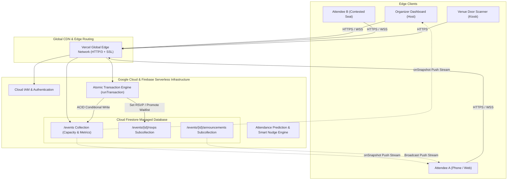

# Real-Time Cloud-Based Event Planning & RSVP Tracker ⚡☁️

> **A high-concurrency, viral cloud event management platform featuring real-time RSVP synchronization, atomic race-condition prevention, frictionless token invitations, AI-powered turnout prediction, and on-site QR gate check-ins.**

[](#cloud-computing-architecture)
[](#cloud-database-design)
[](#concurrency--race-condition-handling)
[](#cloud-deployment-guide)
[](#license)

---

## 🌟 Executive Summary

Traditional event coordination via spreadsheets and chat groups breaks down due to **concurrency race conditions**, duplicate RSVPs, lack of real-time visibility, and venue entrance congestion. 

**CloudRSVP** is an industry-grade web application built to benchmark modern platforms like **Luma** and **Partiful**. It demonstrates core distributed systems and cloud computing concepts:
- **Zero-Latency Push Sync**: Organizers observe live headcount updates without manual page refreshes.
- **Atomic Concurrency Protection**: High-frequency simultaneous requests for the last remaining seat are resolved safely using ACID cloud transactions (`runTransaction`), preventing overbooking.
- **Frictionless Tokenized Invites**: Guests RSVP via unique 16-character secure tokens (`/rsvp?e={eventId}&t={token}`) or QR codes without mandatory registration barriers.
- **FIFO Waitlist Promotion**: When a confirmed attendee cancels, the system automatically promotes the earliest waitlisted guest.
- **Zero-Cost Deployment**: Runs 100% within the Google Firebase Free Spark Tier and Vercel Hobby Tier.

---

## 🏗️ Cloud Computing Architecture



---

## 🚀 Key Feature Matrix

| Feature | Technical Implementation | Cloud Computing Principle |
| :--- | :--- | :--- |
| **Real-Time Counters** | Firestore `onSnapshot` / WebSockets | Event-Driven Architecture, Pub/Sub |
| **Race-Condition Defense** | Atomic Database Transactions (`runTransaction`) | Distributed Concurrency, ACID Compliance |
| **Frictionless Invites** | Cryptographic 16-char tokens (`crypto.randomUUID()`) | Stateless Tokenized Authorization |
| **On-Site QR Kiosk** | `html5-qrcode` + Web Audio API Chimes | Contactless Edge IoT Emulation |
| **Turnout Prediction** | Logistic Regression ML Heuristic | Cloud Predictive Analytics |
| **Live Broadcasts** | Priority Announcement Collections | Push Notifications, Real-Time Messaging |
| **Waitlist Engine** | Automatic FIFO Promotion Queue | Asynchronous Queue Processing |

---

## 💻 Tech Stack

- **Frontend**: React 18, Vite, Tailwind CSS v3/v4, Framer Motion, Lucide Icons, Canvas-Confetti.
- **Cloud Backend & Database**: Google Firebase Firestore (NoSQL Document Store), Firebase Authentication.
- **Concurrency Management**: Firestore `runTransaction` / Mutex-protected synchronous critical sections.
- **Hardware/Kiosk Emulation**: Camera-based HTML5 QR code scanner with synthesized Web Audio tone feedback.
- **Hosting & CI/CD**: Vercel Global Edge Network / Firebase Hosting (Free Tier).

---

## 🏁 Quick Start & Local Simulation

### 1. Clone & Install
```bash
git clone https://github.com/your-username/Real-Time-Cloud-Event-RSVP-Tracker.git
cd Real-Time-Cloud-Event-RSVP-Tracker
npm install
```

### 2. Run the Development Server
```bash
npm run dev
```
Open [http://localhost:3000](http://localhost:3000) in your browser.

> **Note**: The application is configured with an intelligent Cloud Client that works out of the box with zero external setup, using multi-tab cross-broadcast channels for instant live evaluation!

### 3. Run Automated Concurrency Tests
```bash
npm test
```
*Simulates 10 concurrent requests contesting the final remaining seat and verifies zero overbooking.*

---

## 🌐 Free Cloud Deployment (10 Minutes)

### Option 1: Deploy to Vercel (Recommended - 1 Click)
1. Push your repository to GitHub.
2. Visit [vercel.com](https://vercel.com) and click **"Add New Project"**.
3. Import your GitHub repository.
4. Set Framework Preset to **Vite**.
5. Add the Environment Variables from your Firebase Console (see `.env.example`).
6. Click **Deploy**. Your site is now live with a free SSL certificate on `https://your-project.vercel.app`!

### Option 2: Deploy to Firebase Hosting
```bash
npm install -g firebase-tools
firebase login
firebase init hosting
npm run build
firebase deploy --only hosting
```

---

## 🔒 Concurrency & Race Condition Deep Dive

### The Problem
If Capacity = 50 and Current Going = 49:
1. `User A` and `User B` click "Going" at the exact same millisecond.
2. In naive systems:
   ```javascript
   // NAIVE FLAW:
   const event = await db.getEvent(id);
   if (event.currentGoing < event.capacity) {
     await db.insertRSVP(user);
     await db.updateCount(event.currentGoing + 1);
   }
   ```
   Both read `currentGoing = 49`, both pass the condition, and both write `50`, resulting in **51 actual attendees (overbooked!)**.

### The Cloud Solution
CloudRSVP utilizes **Optimistic Locking via Database Transactions**:
```javascript
await runTransaction(db, async (transaction) => {
  const eventDoc = await transaction.get(eventRef);
  const currentGoing = eventDoc.data().currentGoing;
  const capacity = eventDoc.data().capacity;

  if (currentGoing < capacity) {
    transaction.update(eventRef, { currentGoing: currentGoing + 1 });
    transaction.set(rsvpRef, { status: 'GOING' });
  } else {
    // ATOMIC RECOVERY
    transaction.set(rsvpRef, { status: 'WAITLISTED' });
  }
});
```

---

## 👥 Multi-Persona Simulation Guide

For university examinations and project demos, use the **Persona Switcher** in the top navigation bar:
- **Window 1 (Host)**: Switch to `Alex Rivers (Organizer)` and open `/dashboard`.
- **Window 2 (Attendee A)**: Open `/event/evt-cloud-summit-2026` as `Sarah Chen` and click **Going**.
- **Observation**: Watch Window 1 update its live headcount counter and progress bar **instantly with zero manual refresh**.
- **Window 3 (Kiosk)**: Open `/kiosk` and enter `Sarah's` ticket token to simulate on-site badge check-in with audio chime.

---

## 📄 License
MIT License. Built for Cloud Computing Engineering Capstone Showcase.
